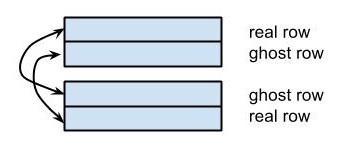
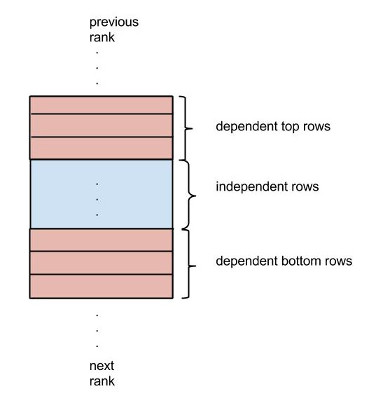

<!-- vim: set ts=4 sw=4: --> 
Konzepte des zugrundeliegenden (Anwendungs)-Modells


Parallelisierungsschema (Kommunikationsmuster, Verteilung der Daten & Aufgaben)

Es sollte mit MPI parallelisiert werden (optional: Shared-Memory Parallelisierung mit Threads oder OpenMP).

Leistungsanalyse des sequentiellen Codes (Verhält sich dieser Erwartungskonform)

Skalierungsverhalten der parallelen Version

Speedup-Diagramme

Potentiell Analyse mit Vampir/Sunshot

Durchführung einer Optimierung der parallelen Version (Kommunikationsschema etc.)


---
# Parallelisierungsschema
Das Feld wird implementiert durch ein 2D-Array of struct Ideas.

```c
#define malloc_idea_matrix(name)                              \
    Idea **name = (Idea **)malloc(num_rows * sizeof(Idea *)); \
    for (int i = 0; i < num_rows; ++i)                        \
        name[i] = (Idea *)malloc(num_cols * sizeof(Idea));    \
```

Es werden *zwei* Felder erstellt:

```c
malloc_idea_matrix(field)
malloc_idea_matrix(field_new)
```

`field` wird daraufhin mit leeren Ideen initialisiert und an zufaelligen Positionen mit Ideen bespawned. Der Inhalt von `field` wird dann in `field_new` kopiert. Man braucht zwei Felder, damit eine Idee nur ein mal pro Runde ziehen kann: es wird über den Inhalt von `field` iteriert, die gezogenen Ideen werden in `field_new` reingeschrieben. Wenn dannzum Beispiel eine Idee nach rechts zieht, wird sie im naechsten Iterationsschritt nicht noch einmal zum Zuge kommen. Kopieren ist folgendermaßen implementiert:

```c
#define copy_field_into_field_new()        \
    for_every(i, num_rows, {               \
        for_every(j, num_cols, {           \
            field_new[i][j] = field[i][j]; \
          });                              \
    });
```

Wir haben hier erst versucht, mittels `memcpy` das ganze effizienter zu gestalten, nur um irgendwann festzustellen, dass das mit derartigen 2D-Arrays nicht funktioniert, da ja  bei memcpy nur die Pointer, die auf eine row des Arrays verweisen, kopiert werden, was wir nicht wollen, da die Ideen by value kopiert werden müssen.

Die Aufteilung dieses Feldes auf die MPI-Prozesse funktioniert nun per horizontaler Spaltung des Feldes. Das hat den Vorteil, dass nur an zwei Kanten kommuniziert werden muss, oben und unten. An den Raendern gibt es "ghost rows": Nach unten hin betrachtet wird die letzte "reale" row die "ghost row" des naechsten ranks, und wird in dessen Feld als zusaetzliche Reihe über dessen erster "real row" repraesentiert. Die Kommunikation besteht also im Austauschen der eigenen real und ghost rows mit den drunter und drüber liegenden Nachbarn. 



Dies ermöglicht, dass jeder Prozess seine Züge unabhaengig von den anderen Prozessen machen kann: wenn eine Idee auf einer "real row" nach oben respektive unten zieht, so hat sie die Informationen, was sich in der Zielzelle, die ja eigentlich vom benachbarten Prozess bearbeitet wird, befindet. 

Aus dem Vorhandensein dieser zwei rows, die an den Raendern der rank-spezifischen fields jeweils sind, folgt das Konzept von "independent" und "dependent" rows: 



*Drei* rows sind an den Raendern jeweils "dependent": die zwei aeussersten müssen direkt mit den Nachbarn kommunizieren und drittaeusserste kann durch Bewegung von Ideen in die zweitaeusserste row ebenso "dependent" sein. "Dependent" heisst hier: die Bewegung von Ideen kann die anliegenden ranks "etwas angehen". Die "independent" rows hingegen tangieren die anderen ranks nicht, jedenfalls nicht innerhalb *einer Runde*, denn pro Runde kann eine Idee ja nur ein Feld weiter ziehen. Aus dieser Erkenntnis folgt, dass die Bewegung im Feldabschnitt der "independent rows" unabhaengig von den andern ranks erfolgt, die der "dependent rows" allerdings nicht und somit zeitlich orchestriert werden muss.

Diese Orchestration erfolgt in drei Schritten, die Schritte gelten für jeden rank:

1. Bewege die Ideen die sich auf den "independent rows" befinden.
2. Bewege die Ideen, die sich auf den "dependent top rows" befinden.
    1. Sende top real und top ghost row zu oberem Nachbarn.
    2. Empfange top real und top ghost row von unterem Nachbarn.
3. Analog wie 2. für die bottom dependent rows.

Das Senden und Empfangen wird mittels `MPI_Isend` und `Irecv` realisiert. Dies hat den Vorteil, dass real und ghost row nacheinander versendet werden, ohne erst auf die Empfangsbestaetigung für das erste Paket zu warten. 

Im Code sieht das so aus:

```c
#define send_ideas(ideas_arr, to, tag, req) \
  MPI_Isend(ideas_arr, num_cols, mpi_idea_type, to, tag, MPI_COMM_WORLD, &req) 

#define receive_ideas_into(ideas_arr, from, tag, req) \
  MPI_Irecv(ideas_arr, num_cols, mpi_idea_type, from, tag, MPI_COMM_WORLD, &req) 

#define send_top_rows(field) \
  /* send our first ghost row into the bottom real row of the previous rank */ \
  send_ideas(field[0], prev_rank, GHOST, req);                                \
  /* send our first real row into the bottom ghost row of the previous rank */ \
  send_ideas(field[1], prev_rank, REAL, req2);                                 \

#define receive_into_bottom_rows(field) \
  /* receive first ghost row from next rank into our bottom real row */ \
  receive_ideas_into(field[num_rows-2], next_rank, GHOST, req);        \
  /* receive first real row from next rank into our bottom ghost row */ \
  receive_ideas_into(field[num_rows-1], next_rank, REAL, req2);         \
```

Der `mpi_idea_type` wird hierbei auf folgende (kompliziert anzuschauende) Art definiert:

```c
#define mpi_define_idea_type()                                               \
  int          blocklengths[5] = {1,1,1,1,1};                                  \
  MPI_Datatype types[5] = {MPI_INT,MPI_INT,MPI_INT, MPI_INT, MPI_INT};               \
  MPI_Datatype mpi_idea_type;                                                \
  MPI_Aint     offsets[5];                                                   \
  offsets[0] = offsetof(Idea, a);                                            \
  offsets[1] = offsetof(Idea, b);                                            \
  offsets[2] = offsetof(Idea, c);                                            \
  offsets[3] = offsetof(Idea, h);                                            \
  offsets[4] = offsetof(Idea, empty);                                        \
    MPI_Type_create_struct(5, blocklengths, offsets, types, &mpi_idea_type); \
    MPI_Type_commit(&mpi_idea_type);                                         \
```

Die Kommunikation benutzt im Übrigen `field_new` zum Austausch der Daten; am Ende einer Runde wird dieses dann pro Prozess in `field` kopiert.

Es ist entscheidend, die einzelnen Schritte per `MPI_Barrier` abzutrennen, da es sonst zu race conditions kommt.


# Implementation der Visualisierung
Wir haben die Visualisierung lokal mit Pygame implementiert. Die Daten werden von C, sofern `#define DRAW` gilt, per Prozess per Runde in `src/draw/out/$round-$proc` exportiert und dann im Nachhinein von Python eingelesen. Dies hat den entscheidenden Nachteil, dass zum einen der Nutzen des Clusters eingeschraenkt ist: um diesen zu nutzen *und* die Visualisierung zu nutzen, müssen die Output-Files auf dem Cluster generiert und dann nach local kopiert werden (das haben wir auch implementiert per einem automatisierten Deploy script, dass den Quellcode auf den cluster rsynct, dort das Programm laufen laesst und dann die Output-Files wieder per rsync zurück kopiert; dies ist bloß leider sehr eingeschraenkt praktikabel wegen der Dateimenge - damit wird der Performance-Gewinn durch das Mehr an Prozessen unterminiert). Zum anderen ist von Nachteil, dass hiermit keine Realtime-Visualisierung möglich ist. 

Das Problem von Realtime-Visualisierung scheint uns aber kein triviales zu sein: schließlich müssten die Daten vermutlich in einem master rank pro Runde gesammelt werden um sie dann grafisch auszugeben; außerdem war uns nicht ganz klar, wie und ob so etwas überhaupt auf dem Cluster - per X-Forwarding - funktionieren würde, weshalb wir uns dann für die lokale Scripting-Variante entschieden haben. 

# Performance

Wie zu erwarten, ist die Performance mit aktiviertem IO ca. um den Faktor 80 schlechter als ohne:


Hingegen ist der Speedup aehnlich (ein Wert von 1 hieße eine lineare Relation zwischen Anzahl von Prozessen und absoluter Geschwindigkeit, weniger entsprechend weniger effektiv):


Der absolute Verlauf ohne IO sieht wie folgt aus:


Die Ausschlaege sind in diesem Fall relativ stark, sie treten allerdings immer auf und treten dann auf, wenn ein zusaetzlicher Rechner innerhalb des Clusters dazukommt, da dann ein Mehraufwand an Network-Kommunikation auftritt. 

Die relativen Speedups und die Abnahme der Effizienz ist damit zu erklaeren, dass das Verhaeltnis von MPI-Kommunikation zu realer Rechenzeit steigt und insofern der Anteil an "teuren" Instruktionen staendig größer wird. 

# Optimierung
Folgende Optimierungen haben wir im Laufe der Entwicklung vorgenommen:

1. `MPI_Isend/Recv` anstelle von `Send/Recv` einsetzen.  Dies brachte ca. 10% Speedup.
2. Den `field_new` -> `field` Kopiervorgang nur einmal ausführen. Dies war Bestandteil eines tieferen Problems, was uns viele Stunden Bugs und Mühen beschaeftigt hat, auch wenn es im Nachhinein trivial wirkt: die ersten Wochen hatten wir das `field` (und nicht `field_new` in der MPI-Kommunikation verschickt. Dies führte zu Korruptionen im Feld, die Ideen vermehrten sich, aber nur manchmal, bei einer genügend hohen Ideendichte. Durch die Zufaelligkeit der Simulation war das ganze auch quasi unmöglich zu debuggen; der Schleier wurde erst von unseren Augen genommen, als wir eine Drop-In "quasi-unit-test" Bewegungsmethode implementierten, die die Ideen immer nur nach unten gehen ließ. Es handelt sich insofern nicht um eine Performance-Optimierung, sondern um eine Optimierung der Zuverlaessigkeit des Systems.
3. Den schon oben angesprochenen Versuch, das Kopieren von `field_new` in `field` per `memcpy` umzusetzen. Auch dies funktionierte leider erstmal "irgendwie", sodass der Eindruck entstand, die Simulation tue das, was sie tuen solle. Leider wurden auf diese Art ja aber nur Pointer auf die einzelnen rows kopiert, was zu fiesen, ebenso schwer zu findenden Bugs führte. Natürlich haette es enorm geholfen, sich einfach besser mit C auszukennen; so war man auf das kollektive Wissen von Stack Overflow angewiesen und verlor viele Stunden mit Bugsuche. 

Generell also kann man den Entwicklungsprozess, was den MPI-Part anging, hauptsaechlich als ein Suchen nach Bugs, die den Großteil der Zeit extrem "mysteriöse" Resultate erzeugten, beschreiben. Leider war Debug-Tooling hier nicht wirklich hilfreich, zum einen wegen der involvierten Randomness, die zu nicht reproduzierbaren Ergebnissen führte, zum anderen, weil erste spezifische Konstellationen des Feldes zu korrupierten Ergebnissen führten. 

Dementsprechend kann man unsere Strategie bezüglich MPI, als denn alles so funktionierte, wie es sollte, als sehr defensiv beschreiben; das System erschien uns so fragil, und wir wollten endlich eine funktionierende Basis für die Simulation an sich haben. Daher kann es durchaus sein, dass der MPI-Part noch optimiert werden könnte; wobei unser Kommunikations
